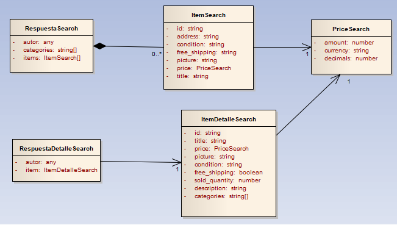

#CHALLENGE FRONTEND MELI:

##SÍNTESIS DEL ENUNCIADO:
Construir las vistas relacionadas a la búsqueda, listado resultante(sólo 4 productos) y detalle del producto seleccionado. 
Generar los endpoints /api/items?q=:query y /api/items/id:id  los cuales consultan a servicios facilitados por Meli.

##CARACTERÍSTICAS DE CALIDAD CONSIDERADOS:
A través del diseño y stack tecnológico implementado, la aplicación busca abarcar los conceptos de usabilidad, SEO, performance y escalabilidad. 

##STACK TECNOLÓGICO UTILIZADO:
Cliente:

* Angular 12.0.2

* Bootstrap 5

Servidor:

* Node 14.17.0

* Express
	
##MODELO DE NEGOCIO:

RespuestaSearch: es la respuesta del servicio de búsqueda del producto (getSearch).
ItemSearch: contiene la información particular del producto.
PriceSearch: contiene la información del precio del producto.

RespuestaDetalleSearch: es la respuesta del servicio del detalle del producto(getDetail)
ItemDetalleSearch: contiene la información de las características particulares del producto.
PriceSearch: contiene la información del precio del producto.

##SERVICIOS:
Se implementan dos servicios Rest de tipo get.
/api/items?q=:query
Devuelve el listado de productos limitando a una respuesta de 4 items.

/api/items/:id
Devuelve el detalle de un producto a partir de un id.